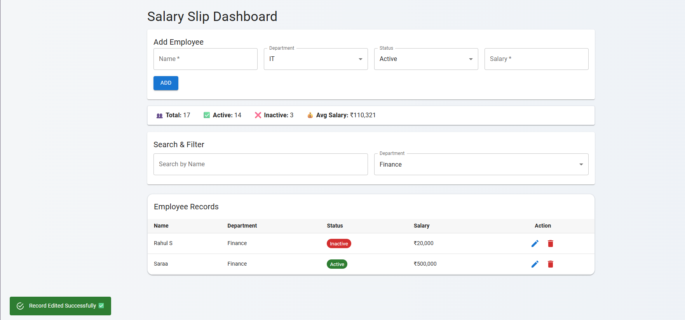

# Salary Slip Dashboard

A full CRUD dashboard built with React, Redux Toolkit, Material UI, and JSON Server.

## Features
- Add, edit, delete employee records
- Search and filter
- Pagination
- Modal edit form
- Status chips and snackbar notifications

## Tech Stack
- React (Vite)
- Redux Toolkit
- Material UI
- JSON Server (mock backend)

## How to Run
**Backend:**
```bash
npx json-server --watch backend/db.json --port 3001
```

**back end runs at:**
```bash
http://localhost:3001/records
```


**Frontend:**
```bash
npm install
npm run dev
```

**Frontend runs at:**
```
http://localhost:5173
```
## 📸 Dashboard Preview




